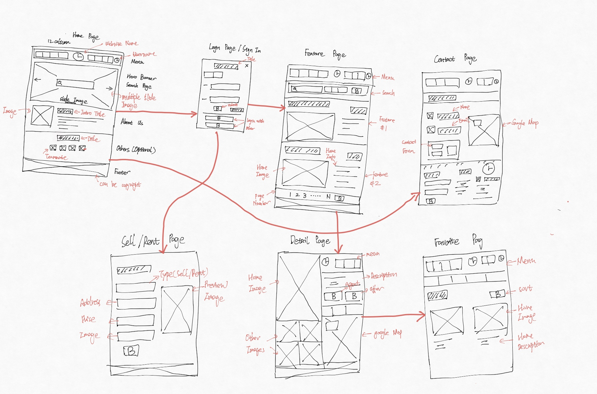

# fa20-cmpe-202-sec-03-team-project-202-team

# Your Team Name
    HomerFiner Developer
    
# The names of each team member
    An Bo
    Ruichun Chen
    Dongmei Yin
    Weichao Liang
    
# A summary of areas of contributions (for each team member)
    An Bo:
    Ruichun Chen: Sell Page, Rent Page, Rent Application Page, Rent Visit Page, Rent Listing Page, Rent Filter Bar, Sale Filter Bar, Save Search, Sale Lisitng Page, Manage     Rentals Page, Realtor Page, Realtor Detail Page, Search Realtor Page, Admin Page, 
    Dongmei Yin:
    -	Backend design & coding with Express js
    -   System architecture diagram
        o	Login function
        o	Buy/Rent page data retrieval
        o	Approve/Reject/Remove users for admin
        o	Sell/RentOut home listing insertion
        o	Buy/Rent application insertion & notification email to owner/realtor
        o	Retrieve/delete/update properties for sale
        o	Schedule open house
        o	Retrieve/delete/update properties for rent
        o	Schedule visit
        o	Retrieve/approve/reject Buy/Rent applications & send notification email to applicant
    -	Database design and implementation
    -	Testing
    -	Code Deployment onto AWS

    Weichao Liang:
    
# Link to your team's Google Sprint Task Sheet
    Link: https://docs.google.com/spreadsheets/d/10t7nQZ7mw0GsuoKvn8TLyeAO8zWAKiNflflNgLXNAtk/edit#gid=1730128268

    

    

# some npm install command:
    backend:
        npm i bcrypt
        npm i body-parser
        npm i jsonwebtoken
        npm i nodemon
        npm i multer --save
        npm i nodemailer --save
    frontend:
        npm install react-icons --save
        npm i google-maps-react
        npm install react-bootstrap bootstrap
        npm i contentful
    clean git log:
        git reset --hard

## How to start the project
    Two terminal are needed for the frontend and backend;
    1. cd in to the app folder, in the terminal type: npm start(start the react project)
    2  cdd to the backend folder, enter npm start(start the backend)
    the front end is listed on the port 3000
    the back end is listed on the port 9000
    
Github Project Management:

User story => 	Issue\
Task => Task lists\
Epic => Epics\
Points and estimation => 	Weights\
Product backlog => 	Issue lists and priority labels\
Sprint/iteration => 	Milestones\
Burndown chart => 	Burndown charts\
Agile board => 	Issue board

# HomeFinder - Find your next home

## Problem Statement
    Develop a web application that lets users buy, sell or rent homes
    (Something like Zillow.com – it is recommended you visit one of these sites to get familiar with the
    problem space and terminology)

### Requirements
    1. Administrator - the administrator
    2. User (Renter, Landlord, Buyer, Seller) – Renter and Landlord are specific to rental listings;
    Buyer and Seller are specific to Home Sale listings
    3. Realtor – a real-estate agent who can act on behalf of any type of User 

### Usecase(required)
1. <strong>Register/Login</strong>: 
    Available for all roles
2. <strong>
    Approve/Remove users</strong>: The administrator can approve, reject or remove any users if the
    need arises.
3. <strong>Search</strong>: 
    All types of roles can search for Sale or rental listings - based on zip code or street
    address, and/or other attributes – price range, sqft., #bedrooms, #bathrooms, carpet vs
    wooden flooring, home type (apartment/townhome/attached Single Family Home or Detached
    Single), open/closed parking, other amenities, Year built etc.
4. <strong>Save as Favorites</strong>: 
    Users are able to save Favorite searches and Favorite Homes
5. <strong>Sell</strong>: (Realtor or Seller)
    Upload details of home to be listed
    You could list multiple homes if you are a realtor(acting on behalf of multiple sellers)
    Update status or other details of listing(s)
    Schedule open houses
    Review buyers’ applications and approve/reject
    Remove listing
6. <strong>Buy</strong>: (Buyer or Realtor)
    Submit an application with an offer for the home –an email sent to the Seller/seller’s realtor
7. <strong>Rent out (Realtor or Landlord)</strong>: 
    Add new listing, Upload details of home, Update lease terms,
    Availability date, Security deposit, schedule visits, Review renter’s applications and
    approve/reject, update listing details, remove listing
8. <strong>Rent (Renter)</strong>: 
    Submit an application for the lease, including credit score, employment
    information - an email sent to the Landlord/landlord’s realtor

### Note for each meeting
## Backlog
1. Register/Login (user table)
2. Approve Remove (Admin approve, reject and remove method) (waitlist table)
3. Search: Sale, Rent(zip, price, sqft...) (sell/rent table)
4. Favorites: save search (favorite table)
5. Sell: Add home(home price, sqft,... )(seller, realtor) (sell table)
6. Buy: application form => email (buy application table)
7. Rent: Add/Update listing(rent term, type), print/update application (listing table/application table)
8. Rent: application form (rent application table)
9. UI
10.  Unknown
11. different roles (Admin, User, Realtor) 
12.  Database

## Scrum 1: 
    Figure out programming framework
    Frontend: React 
    Backend: Express + MySQL
    Learn & Explore about programming languages
    Raw database schema & SQL code for db creation

## Scrum 2:
    Preparing basic knowledge about languages.
    Build up an overall template.

## Scrum 3 :
    Frontend: Login.js Signup.js
    Backend: Main.js(for login and signup validation)

## Scrum 4 :
    Frontend: 
        Setup UI
        Sign up 
        User page
        Saved homes(favorite?)
        Saved searches(favorite)
        Listings(rent/sell home)
        Account setting(update profile)(function)
    Backend: 
        Rachel for Register
        (user table) (waitlist table) (sell table) (favorite table) (buy application table) (listing table) (rent application table)
        Table fields

## Scrum 5 :
    Frontend: 
        Buy page with house UI
        Sell page with sell by owner form
        Complete User page (favorite, search, listing) 
        Format data from house list => search(filter by zip code, bath, bed, price etc.)
        … prepare for filter agent, open house schedule
    Backend: 
        Register as realtor → Rachel
        Admin reject/remove  → lyn
        Get all house data (buy/rent page) → Lyn
        Search house
        by different keywords → Rachel
        filter home → frontend
        ...prepare for return favorite(save house) list => favorite table, save search, add listing(sell), 

## Scrum 6 :
    Frontend: 
        Rent page with house UI
        Profile page(listing page, saved home, save search, review application) 
        Rentals page(post list page, update page, application page) 
        Agent page 
        Application page open house schedule
    Backend: 
        Search from all sell/rent
        Save as favorite
        Sell
        Upload details of home list 
        Update status/other details of home list 
        Remove listing 
    Schedule open house 
        Review buyer’s application → approve and reject-
    Buy
        Submit application with an offer for the home
        Email sent to landlord/landlord’s realtor
    Rent out
        Upload details of home list
        Update details of home list (lease term, availability date, security deposit)
        Remove listing
        Review renter’s application → approve and reject
        Schedule visit
    Rent
        Submit application for lease (include credit score and employment history)
        Email sent to landlord/landlord’s realtor

#### System Architecture Diagram

    
                                                                              

#### Wireframe Diagram

    

#### Wireframe Diagram (Update)

    

#### Database Schema Diagram

    

